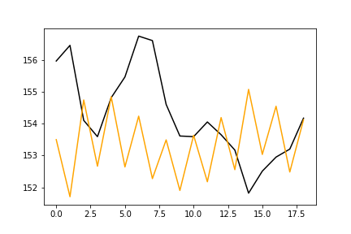

# DSAI-HW2-2022
The homework-2 of the [NCKU](https://www.ncku.edu.tw/index.php?Lang=en) course which named Competitions in [**D**ata **S**ciences and **A**rtificial **I**ntelligence](http://class-qry.acad.ncku.edu.tw/syllabus/online_display.php?syear=0110&sem=2&co_no=P75J000&class_code=).<br>
* [The example code](https://github.com/NCKU-CCS/DSAI-HW2-2021).
* [The profit calculator (評分程式，原版)](https://github.com/NCKU-CCS/StockProfitCalculator).
* [The profit calculator kai (評分程式，本人修改為方便建置的 conda 版)](https://github.com/kuihao/StockProfitCalculator_CondaVer)
## PROBLEM DESPRICTION
### TASK
Given a series of stock prices, including **daily open (opening price), high (highest share price), low (lowest share price, and close (close price)**, decide your daily action and make your best profit for the future trading. Can you beat the simple **“buy-and-hold”** strategy?
### RULE
Given 20 days of stock market operations, only one operation can be performed each day:<br>
0 means no action, <br>
1 means buy one stock, <br>
-1 means sell one stock.<br>
Short selling is permitted. <br>
**The maximum number of stocks in the stock account for this operation is one stock or one short sale.** If you have bought one stock, you need to wait for another day to sell it, and then wait for another day to buy it back, so **you cannot buy and sell on the same day**.
### GOAL
Maximize revenue in 20 days.
### NOTICE
* **每讀完一天的資料，就必須輸出隔天是否要購買股票，輸出後才能再讀下一天的資料，以此類推。**
    * E.g.:
        * D = 新的一天股票資料產生
        * A = 模型執行的動作 (-1, 0, 1)
        * **合法的順序： DADADADADA**
* **違反下列規則 0 分計算:**
    * 使用非法的測試資料讀取方式，E.g.: DDDDDADDA
    * 一次讀完全部股票資料才輸出是否要購買
    * 修改輸出結果
    * 輸出結果數量不正確
    * Your code is the same as other classmate’s.
    * Your Github repo does not contain your code.
    * You do not submit the homework before the deadline.
    * **The training dataset you used is not provided by TA. (言下之意，不能更改/新增 training data)** 
    * Your code can get data through the Internet during training or testing. (不能使用爬蟲) 
    * Your code terminates during testing.
### Q&A
**Q:** Can I buy one stock at first day (status = 1), the sell and short selling of it at the same sencond day (status = -1)?<br>
**A:** Outputs 描述的是 "操作" 而非狀態，1 為買入一張股票，0 為不操作，-1 為賣出一張股票<br>
也就是說，如果output的前兩天都是1即代表，你同時持有兩張股票是種違規操作，而你的例子<br>
Day 1 outputs "1"<br>
Day 2 outputs "-1"<br>
代表你最後不持有任何股票
## NSTRUCTIONS FOR USE
(環境建置及程式使用說明)<br>
<div style="background-color: #FFFF00">💡<b>請助教依照下方步驟建立 conda 虛擬環境</b></div>
<div style="background-color: #FFFF00">💡<b>Please follow the steps below to create the conda virtual environment.</b></div>

### Prerequisite
- [conda](https://docs.conda.io/en/latest/index.html) at least 4.10.3 

### Build Eev.
create an python 3.6 env.
```sh 
conda create -n HW2-Env-withGPU-py36 python=3.6.4 tensorflow-gpu
```
To activate Env. in **linux**:
```sh 
conda activate HW2-Env-withGPU-py36
```
To activate Env. in **windows**:
```sh 
activate HW2-Env-withGPU-py36
```
### Install Dependency
```
conda install --yes --file requirements.txt
```
or
```
pip install -r requirements.txt
```
### To save new requirements.txt
```shell 
conda list --export > requirements.txt
```
or
```shell 
pip freeze > requirements.txt  
```

### To execute our code
<div style="background-color: #FFFF00">💡<b>請助教輸入下方命令以執行 app.py</b></div>
<div style="background-color: #FFFF00">💡<b>Please enter the following command to run app.py</b></div>

**Recommendation:** 
default **retrain mode** is on, if the assistant coach thinks the program is running too long please enter the following formula code to turn off retrain mode.

```shell 
python app.py --training training_data.csv --testing testing_data.csv --output output.csv
```
<div style="background-color: #FFFF00">💡<b>若程式執行時間太久、超過允許執行時間上限，請助教改執行下方程式碼</b></div>
<div style="background-color: #FFFF00">💡<b>If the program takes too long to run and exceeds the allowable execution time limit, please ask the assistant teacher to run the following code instead</b></div>
To turn off retrain mode:

```shell 
python app.py --training training_data.csv --testing testing_data.csv --output output.csv --retrain 0
```

## HIGHLIGHT (PROPOSED METHOD)
### Observeation
Draw candlestick to observe the trend of input data<br>
Training data 20 days<br>

Training data all time<br>

Observe the frequency domain<br>

### Data Preprocess
Calculate moving average: Opening price<br>

Calculate moving average: Closing price<br>

### Model (GRU)
**Model 1:** Input data for the previous **120 days (14 features)** to predict **tomorrow's opening and closing prices**
* 

**Model 2:** Input data for the previous **120 days (14 features)** to predict the **opening** and **closing prices** for **tomorrow and the day after**
* 

## LISTING 
(explain the function of each file)
* **app.py 主程式**，使用方式如下: (與範例程式相同) 
```shell 
python app.py --training training_data.csv --testing testing_data.csv --output output.csv
```
* app_v2_Trader.ipynb，Data experiment, main model training and tuning. 
* **app_v3_Only_Trader.ipynb**，Traing Part 的完成版，去除多餘函式並改寫成方便套用於 app.py 的格式
* ./model，儲存多個實驗模型，穩定版本為 model(1/2)_2022_04_21__21_08_52.h5
* ./log，對應實驗模型的實驗記錄
* training_data.csv、testing_data.csv 作業提供的 raw data
* output.csv 最終結果 (每次執行程式時，會自動把舊的 output.csv 刪除)
## ENVIRONMENT AND EXPERIMENT DESIGN
* Python: 3.6 (3.6.4)
* OS: Ubuntu 20.04 amd64
* GPU: Nvidia Geforce GTX 1070
* [Dataset](https://www.nasdaq.com/market-activity/stocks/ibm), [Training Data](https://www.dropbox.com/s/uwift61i6ca9g3w/training.csv?dl=0), [Testing Data](https://www.dropbox.com/s/duqiffdpcadu6s7/testing.csv?dl=0)
## TRAINING RESULT
* Model 1: Loss and Prediction
    * Loss value training trend
        * 
    * Prediction
        * 
        * The black line is the Train set y value, which is the actual opening price on the next day, for a total of 1248 days
        * The orange line is the model prediction, which is the actual opening price on the next day, for a total of 1248 days
* Model 2: Loss and Prediction
    * Loss value training trend
        * 
    * Prediction
        * 
        * The black line is the Train set y value, which is the actual opening price on the next day, for a total of 1248 days
        * The orange line is the model prediction, which is the actual opening price on the next day, for a total of 1248 days
        * The red line is the model prediction, that is, the model prediction of the next day's opening price, a total of 1248 days

## Action Strategy

- 使用模型預測明後兩天的開盤及收盤價
- 針對以下規則進行股票的買賣行為
  明後兩天開盤結果的高低定義為，若手中持有股票或賣空股票，則會跟買價或賣空價進行比較；若手中沒有股票，則會跟今天的開盤價進行比較，比較時會有一固定閥值(在此設定0.03)，需大於此閥值才算有變化。若小於此閥值則輸出action為0。

    | 持有股票 | 預測後兩天開盤結果 | Action |
    | -------- | ------------------ | ------ |
    | 1        | 高高               | -1     |
    | 1        | 高低               | -1     |
    | 1        | 低高               | 0      |
    | 1        | 低低               | -1     |
    | 0        | 高高               | 1      |
    | 0        | 高低               | -1     |
    | 0        | 低高               | 1      |
    | 0        | 低低               | -1     |
    | -1       | 高高               | 1      |
    | -1       | 高低               | 0      |
    | -1       | 低高               | 1      |
    | -1       | 高低               | 1      |
    
## TESTING RESULT
* Model 1:
  * Model-1 open
    * 
  * Model-1 close
    * 
* Model 2:
  * Model-2 open
    * 
  * Model-2 close
    * 
## EVALUTION
The result of [the profit calculation program](https://github.com/kuihao/StockProfitCalculator_CondaVer) is **1.9699999999999989** (input example 20 days testing.csv and out output.csv) (retrain mode result is as same as non-retrain mode).